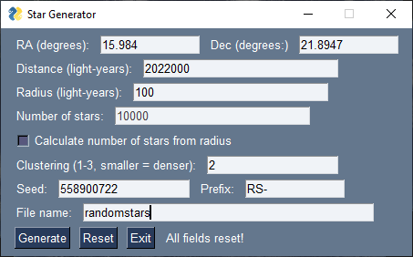
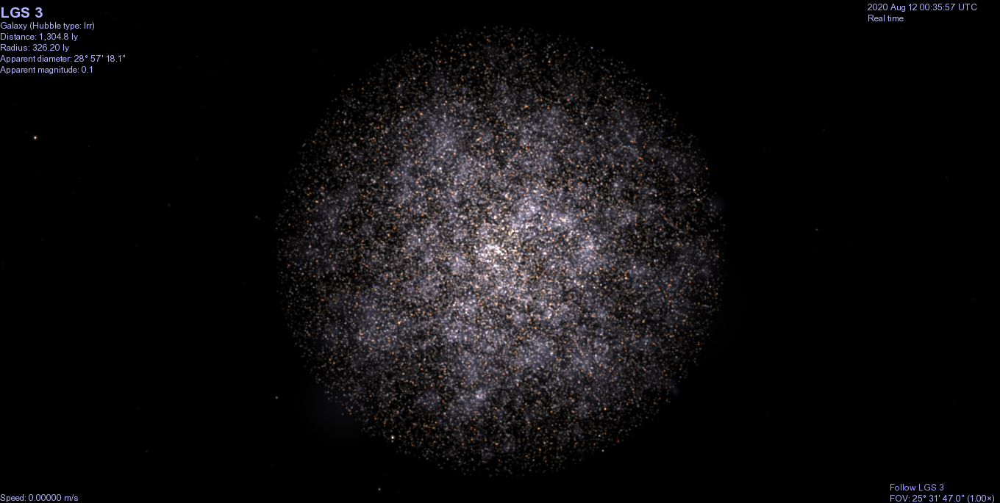

# Celestia Star Generator

This is a program that randomly generates stars for [Celestia](https://github.com/CelestiaProject/Celestia).
It's still a work-in-progress and the code is somewhat messy, but it's definitely usable.
Please report any bugs you find on the Issues page!

There are two ways to run the program. On any operating system, you can install [Python](https://www.python.org/) 3
and the [PySimpleGUI](https://pysimplegui.readthedocs.io/en/latest/) module, and run the program from IDLE or the command line.
For Windows users, there is also a Windows executable available under "Releases".

The icon for the program is a picture of Omega Centauri in Celestia. Credit goes to **nussun** for the included
red giant/supergiant textures and models, **Rassilon** and **Sirius_Alpha** for their similar generators, and the following webpages:

* https://en.wikipedia.org/wiki/Spherical_coordinate_system
* http://datagenetics.com/blog/january32020/index.html
* https://www.pas.rochester.edu/~emamajek/EEM_dwarf_UBVIJHK_colors_Teff.txt

Here's a screenshot to show what the program looks like:

and an example of its output:

**Update 2024:** I don't actively maintain this anymore but I want to ensure it remains functional. Since PySimpleGUI is now a commercial product that's not compatible with open-source projects, I've replaced it with the [FreeSimpleGUI](https://github.com/spyoungtech/FreeSimpleGUI) fork. Let me know if there are any problems.
